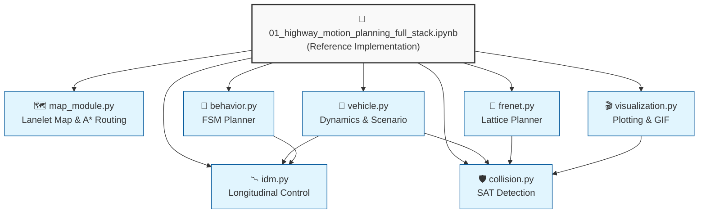

# 🏗️ System Architecture

This document describes the modular architecture of the **Highway Motion Planning Stack**.

## 📦 Module Overview

The project is split into two distinct layers:
1. **Reference Implementation** [`notebooks/`](../notebooks): A monolithic Jupyter notebook for education and rapid prototyping.
2. **Modular Library** [`src/`](../src): Clean, importable Python packages for production use and testing.

### Module Dependency Graph


---

## 🔌 Module Responsibilities
### 1. Map & Routing (map_module.py)
- **Responsibility:** Represents the highway topology and finds global routes.

- **Key Classes:** LaneletMap

- **Algorithms:** A* Search on lanelet graph

- **Inputs:** Highway length, lane count

- **Outputs:** Sequence of lanelets (global path)

### 2. Vehicle Dynamics (vehicle.py)
- **Responsibility:** Models vehicle physics and kinematics.

- **Key Classes:** Vehicle

- **Models:** Dynamic Bicycle Model (Ego), Kinematic (Traffic)

- **Dependencies:** idm.py (for acceleration), collision.py (for corners)

### 3. Longitudinal Control (idm.py)
- **Responsibility:** Calculates acceleration based on traffic gaps.

- **Key Functions:** idm_acceleration(), behavior_desired_speed()

- **Model:** Intelligent Driver Model (IDM)

### 4. Behavior Planning (behavior.py)
- **Responsibility:** High-level decision making (lane changes, stopping).

- **Key Classes:** BehaviorFSM

- **States:** CRUISE, FOLLOW, STOP, LANE_CHANGE_*

- **Logic:** Cost-based state selection with traffic penalties

### 5. Local Planning (frenet.py)
- **Responsibility:** Generates smooth, collision-free trajectories.

- **Key Classes:** FrenetTrajectory

- **Algorithms:** Quintic Polynomials, Cost Function Evaluation

- **Dependencies:** collision.py (for risk assessment)

### 6. Safety Engine (collision.py)
- **Responsibility:** Precise collision detection.

- **Key Functions:** rects_intersect(), get_vehicle_corners()

- **Algorithm:** Separating Axis Theorem (SAT)

- **Note:** No false positives (unlike AABB bounding boxes).

### 7. Visualization (visualization.py)
- **Responsibility:** Rendering and data export.

- **Key Functions:** build_gif(), draw_global_and_local(), export_trajectory_csv()

- **Outputs:** GIF animations, CSV logs, Matplotlib plots
---

## 🔄 Data Flow
sequenceDiagram
    participant Map as Map Module
    participant Behave as Behavior FSM
    participant Frenet as Frenet Planner
    participant IDM as IDM Control
    participant Vehicle as Vehicle Model
    participant Collide as Collision Check
    
    Map->>Behave: Global Route (Lane Sequence)
    Behave->>Frenet: Target Lane & State
    
    loop Every Simulation Step (dt=0.1s)
        Behave->>Map: Get Traffic Gaps
        Behave->>Behave: Decide State (CRUISE/FOLLOW/etc)
        
        Frenet->>Frenet: Generate Candidates
        Frenet->>Collide: Check Collision Risks
        Frenet->>Behave: Best Trajectory
        
        IDM->>IDM: Calculate Acceleration
        IDM->>Vehicle: Apply Controls (ax, steer)
        
        Vehicle->>Vehicle: Update Physics (x, y, yaw, v)
        Vehicle->>Collide: Verify Safety
    end

---

##🚀 Usage Examples

### Importing Individual Modules

```python
from src.map_module import LaneletMap, laneletastar
from src.vehicle import Vehicle, create_highway_scenario
from src.behavior import BehaviorFSM
from src.frenet import compute_frenet_lattice_local
from src.collision import rects_intersect

# Initialize Map
lmap = LaneletMap(length=500, nlanes=3)

# Initialize Ego
ego = Vehicle(laneindex=1, s=50, speed=20, is_ego=True)

# Plan
fsm = BehaviorFSM()
state = fsm.step(d_same=30, d_left=100, d_right=100, lane=1, desired_lane=2)
trajectory = compute_frenet_lattice_local(ego, state, [], route_desired_lane_fn=..., nlanes=3)
```

### Running the Full Stack

See [notebooks/01_highway_motion_planning_full_stack.ipynb](notebooks/Project3_Motion_Planning.ipynb) for the complete end-to-end simulation.